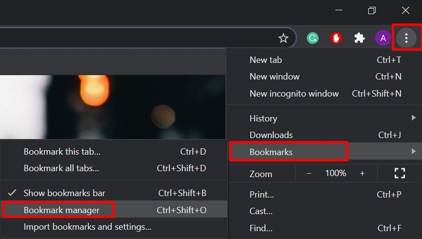
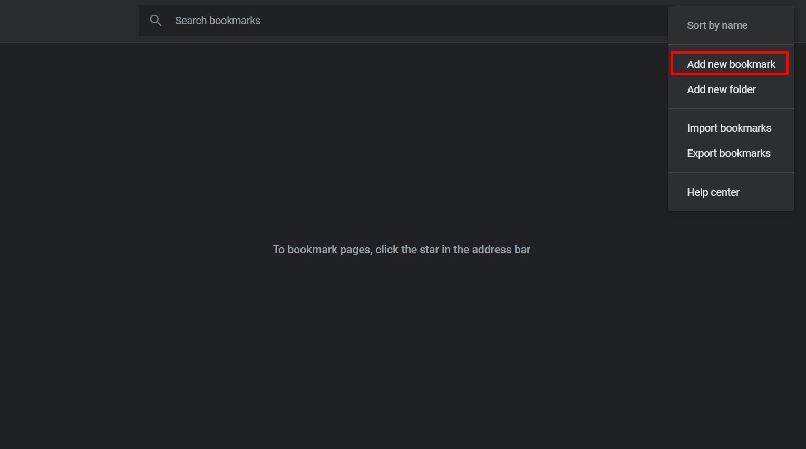
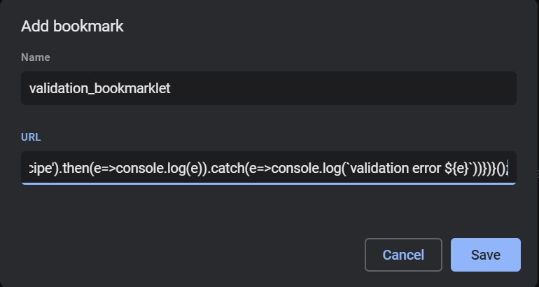

# Bookmarklet for schema validation instructions [work-in-progress]

1) Open the bookmark manager:
<p align="center">
  
</p>
2) Create a new bookmark:

<p align="center">
  
  
</p>

3) In the opened window enter the name of new bookmarklet and past the following code to the URL field:

```
javascript:!function(){let e=(t='//script[@type=\'application/ld+json\']',document.evaluate(t,document,null,XPathResult.FIRST_ORDERED_NODE_TYPE,null).singleNodeValue);var t;if(!e)throw'Structured data in json-ld format is not detected on this page';console.log('Structured data detected, processing...');let n=JSON.parse(e.innerText);'object'==typeof n?n=JSON.stringify(n):JSON.parse(e.innerText).forEach(e=>{e['@type'].includes('Recipe')&&(n=JSON.stringify(e))});let o=document.createElement('script');o.src='https://gnomus042.com/static/js/libs/bookmarklet.validation.bundle.js',o.async=!1,document.body.appendChild(o),o.addEventListener('load',function(){validation.validate(n,'Recipe').then(e=>console.log(e)).catch(e=>console.log(`validation error ${e}`))})}();
```

<p align="center">
  
</p>

4) Validate structured data in web pages by clicking on the bookmarklet. Output will be printed to the console.

***Note that currently the bookmarklet is configured to only validate structured data of type http://schema.org/Recipe and in json-ld format***
## About the project
This is a proof of concept being created as part of a Google Internship. The intent is to demonstrate how standards-based description of search service information requirements can be used to configure structured data validation in a way the highlights all the diverse incentives that exist for using a particular piece of schema markup. The prototype includes examples based on current Google, Pinterest, Yandex and Bing search features, but should be viewed as an illustrative technology demonstration - i.e. the definitions may be inaccurate and incomplete. Ideally such definitions would be published by the relevant organizations, perhaps through bodies such as Schema.org.
